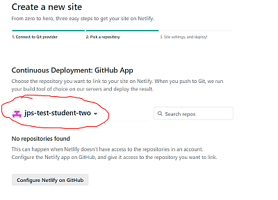
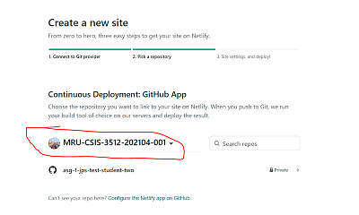

# COMP2512 - Assignment 1

GitHub Classroom link: https://classroom.github.com/a/PSone5Ia

Photo Repository: https://github.com/MRU-CSIS-3512-202104-001/asg-01-images

- [overview](assignment-01.md)
- [milestone 1](milestone-01.md)
- [milestone 2](milestone-02.md)
- [milestone 3](milestone-03.md)

## Hosting Requirements

There are two hosting requirements for this assignment. You'll need to figure out how to do these things through your own research (this _is_ a third-year course!), but I am happy to assist if you get stuck.

### Netlify

You will need to host your site on Netlify. You should clone the assignment repo before doing this, because you'll need a GitHub repo to get very far in the process.

The process isn't very difficult, though I do understand it will be new to most, if not all, of you. Netlify has pretty reasonable documentation and tutorials. I did a search for "hosting static website on netlify" and found [this one](https://www.netlify.com/blog/2016/10/27/a-step-by-step-guide-deploying-a-static-site-or-single-page-app/).

#### GOTCHA

When you're at the step where you're choosing the repository to link to, make sure you change the drop down from your GitHub account:

...to our 3512 organization:

> _Why? Remember that when you accept a GitHub Classroom assignment, the resulting repo that's created is not yours - it's the 3512 organization's! You just have access to it._

### Cloudinary

The assignment images will be hosted on Cloudinary.

There are three basic things you need to do to make this work:

1. get a free Cloudinary account (the free level is sufficient for our needs in the course)

2. upload the assignment images to your Media Library

> _If you Google "upload images to Cloudinary" or such, you're going to get a lot of hits involving using an API or other such thing. That's **way** more complicated than we need! All you need to do is log in, go to your Media Library tab, and drag the image folder into the browser!_

3. Figure out how to use the transformations feature of Cloudinary. I'll leave this part to you to do some research.
