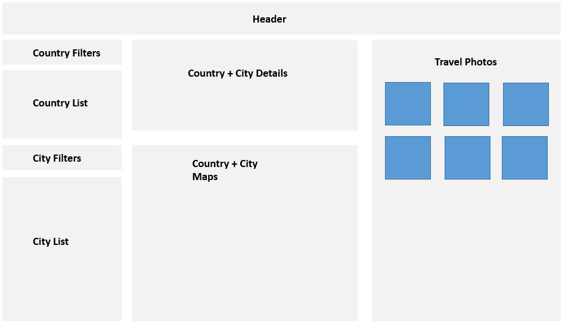
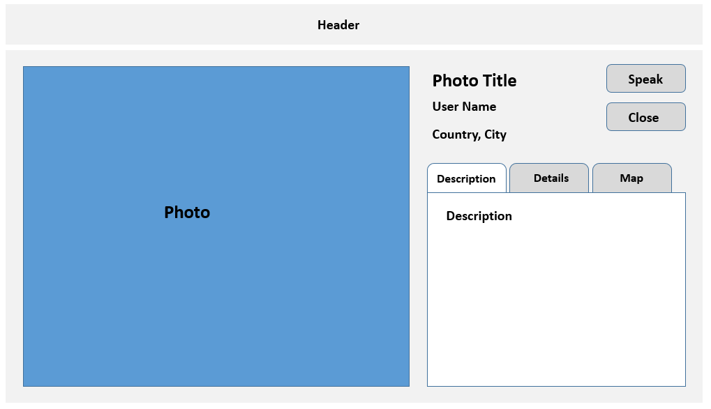
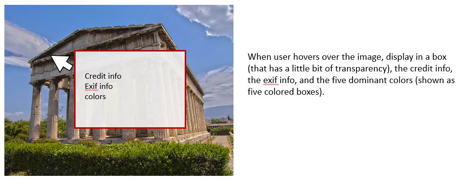

# COMP3512 - Assign 01: Single-Page App

## Overview

This assignment provides an opportunity for you to demonstrate your ability to generate a dynamically updateable single page web application using JavaScript.

This is a fairly complex piece of work and will make a nice addition to your work portfolio. Suitable for framing. And for showing to your parents to convince them your educational choices have, indeed, borne fruit.

## Milestones

Because this assignment is big - like hella-big - it's broken down into three milestones, with the third milestone being the submission of your final work.

Here are the milestones (each has a link to the instruction doc for that milestone) and their deadlines:

1. [Milestone 1](milestone-01.md): Due Sep 22 (W) @ 9:00 PM
2. [Milestone 2](milestone-02.md): Due Oct 06 (W) @ 9:00 PM
3. [Milestone 3](milestone-03.md): Due Oct 27 (W) @ 9:00 PM

### Group Work

The first milestone will be completed on your own.

After the first milestone has been submitted, you will be placed in pairs according to the time you submitted your work and the level of completion of that work. The remaining work in this assignment will be done together with your partner.

## Starting Files

You can grab the starting template for this assignment by accepting this GitHub Classroom Assignment: XXX

There's not much here...just:

- a README.txt that you'll need to fill out, and
- the travel photos used for the page

Everything else will be created by you.

## Submission

Submission instructions are provided in each of the [milestones](#milestones).

## Grading

Grading information is provided in each of the [milestones](#milestones).

## Requirement Details

> _These are the details of the various requirements for this assignment - they are summarized in each of the milestones as well. I thought it would be useful to have them all in one place so you can get a feel for the scope of the assignment._

> _Much of the text here is taken verbatim from Randy's instructions that he used for this assignment in 2019. I'm saying this both to credit him for his work and also as a way of saying "look at what other instructors ask their students to do!"._ :)

### General Requirements

1. Your assignment **must** have just a single HTML page and it **must** be named `index.html`.
2. If you make use of CSS recipes you found online, you must provide references (i.e., specify the URL where you found it) via comments within your CSS file. Failure to properly credit other people’s work in your CSS will likely result in a zero grade.
3. Your layout should work at desktop and mobile sizes. For this assignment, "mobile sizes" are from 320 to 425 pixels (inclusive on both ends), while "desktop sizes" are from 1024px onward.

   > _This means that everything under 320 and between 426 and 1023 pixels is something you can ignore for this assignment._

4. You must write your own JavaScript. That is, no jQuery, no React, no other third-party JavaScript libraries. You have all the knowledge you need from the three JavaScript labs to complete this assignment. If you do find yourself, however, making use of some small snippet of code you found online (say more than 3 lines), then you must provide references (i.e., specify the URL where you found it) via comments within your code. Failure to properly credit other people’s work in your JavaScript will likely result in a zero grade. There is no need to credit code you found in the lab exercises or in lecture.
5. The travel images needed for this assignmnet have been provided for you in the [starting files provided](#starting-files). You must host these images from Cloudinary. Images will need to be presented in a variety of sizes on the pages and you must use Cloudinary's transformation feature to do so.
6. Most of the functionality in the app can be found in the two sketches shown on the next few pages. Each of these is described in more details below.

### Default View Requirements

Here is the Default View (shown here at desktop size):

This is what the user sees when they land on the app.

#### Header

1. The page title should be **COMP 3512 - Assign1**.

#### Country List

1. Displays a list of country names.

2. Should always be sorted alphabetically.

3. When landing on the page, all countries should be displayed.

4. To improve the performance of your assignment, you must store the list of countries in local storage after you fetch it. Your page should thus check if country data is already saved in local storage: if it is then, use it; otherwise, fetch it and store it in local storage. This approach improves initial performance by eliminating an early fetch in future uses of the application.

5. Country data is obtained via an API call. The URL for this API is http://www.randyconnolly.com/funwebdev/3rd/api/travel/countries.php

   > This API takes an optional parameter. Here is the behaviour:
   >
   > - `no paramters`: returns all countries for which there are images
   > - `iso=ALL`: returns a list of all countries
   > - `iso=[iso value]`: returns just the country with the given ISO value (for example, **iso=CA** would return Canada)

#### Country Filters

1. Allow the user to easily filter the **Country List**.

2. User should be able to filter countries in three ways:

   1. show only countries from one or more specified continents, or
   2. show only countries that have images, or
   3. show only countries that start with letters entered by the user

3. You must provide a way to remove filters, thus again showing all countries

4. For each filter, the **Country List** should dynamically update.

5. The filters should be hideable (though initially should be visible)

6. When the user clicks on a country, the **City List**, **Country/City Details**, **Country/City Maps**, and **Travel Photos** should be updated as described in their respective sections.

7. Don’t be scared to use icons instead of text.

8. Assume these filters are mutually exclusive - only one can be active at a time.

#### City List

1. Displays a list of city names in the country selected in the **Country List**.

2. Should always be sorted alphabetically.

3. If the user hasn’t selected a country, then display an empty list.

4. Initially, display all cities in the selected country. Once **City Filters** are applied, what is displayed will change.

5. Most countries have no cities in this assignment in order to keep the amount of data used in the second assignment manageable. If a country has no associated city data, your assignment must be able to handle this elegantly.

6. City data is obtained via an API call. The URL for this API is http://www.randyconnolly.com/funwebdev/3rd/api/travel/cities.php

   > This API takes an optional parameters. Here is the behaviour:
   >
   > - `no paramters`: returns all cities for which there are images
   > - `id=ALL`: returns a list of all cities
   > - `id=[id value]`: returns just the city with the given id value (for example, **id=5913490** would return Calgary)
   > - `iso=[iso value]`: returns just the cities from the country with the given ISO value (for example, **iso=CA** would return all cities in Canada)

#### City Filters

1. Allow the user to easily filter the **City List**.

2. User should be able to filter cities in two ways:

   1. show only cities that have images, or
   2. show only cities that start with letters entered by the user

3. You must provide a way to remove filters, thus again showing all cities in the selected country.

4. For each filter, the **City List** should dynamically update.

5. The filters should be hideable (though initially should be visible)

6. When the user clicks on a city, the **Country/City Details**, **Country/City Maps**, and **Travel Photos** should be updated as described in their respective sections.

7. Don’t be scared to use icons instead of text.

8. Assume these filters are mutually exclusive - only one can be active at a time.

#### Country/City Details

##### Country

1. When the user clicks on a country in the **Country List**, display the selected country's information nicely formatted and laid out sensibly. (Every year students lose easy marks because they put no effort into the layout here.) :

   - name
   - area
   - population
   - capital name
   - currency
   - domain
   - languages

     > _The languages field is a comma-delimited list of ISO 639-2 codes. You must instead display the full name (e.g., English instead of en). When your application first starts up, use the API at http://www.randyconnolly.com/funwebdev/3rd/api/travel/languages.php to retrieve a list of 135 language codes and names. You must store this in local storage to improve performance. Some languages in the comma-delimited list have a hyphen and regional information (e.g., en-CA for Canadian English eh). Ignore the hyphen and the region and just display the main language name. Some languages don’t appear in the languages file: you can ignore those. Use the JS `find` method to help you with this task._

   - neighbouring countries, and

     > _The neighbours field is a comma-delimited list of ISO codes. You must display the full name of the neighbouring countries (for example, United States and not US). Since you will have already stored the country list in local storage, you can simply search this array using the JS `find` method._

   - description

##### City

1. When the user clicks on a city in the **City List**, display the selected city's information nicely formatted and laid out sensibly:

   - name
   - population
   - elevation
   - timezone

   These details should **replace** the country details that were previously present!

#### Country/City Maps

##### Country

1. When the user clicks on a country in the country list, display a static map of the country using Google Maps Static API.

   > _This is just an  tag but with the src attribute a link to Google’s API URL. This will require using your API key. See Exercise 10.13 in Lab 10 for an example._

2. Use a zoom level between 6-9.

##### City

1. When the user clicks on a city in the city list, two things will happen:
   1. The static country map will be replaced with a new static country map that includes a marker for the city (again, you will use the Google Maps Static API), and
   2. A static road map of the city (zoom level between 9-14) is displayed.

#### Travel Photos

1. When a user clicks on a country in the **Country List** or a city in the **City List**, you will need to fetch the appropriate travel photos from the following API: http://www.randyconnolly.com/funwebdev/3rd/api/travel/cities.php

   > This API takes optional parameters. Here is the behaviour:
   >
   > - `no paramters`: returns all images
   > - `id=ALL`: also returns all images
   > - `id=[id value]`: return a single image with the given id value
   > - `city=[city id]`: returns all images from the city with the specified id value (for example **city=5913490** would return all photos from Calgary)
   > - `iso=[iso value]`: returns all images from the country with the given ISO value (for example, **iso=CA** would return all cities in Canada)

2. Travel photos will be displayed as a 75px square thumbnail at mobile sizes and a 150px square thumbnail at desktop sizes.

3. A `<picture>` element must be used to display thumbnails.

4. All travel images must be served from Cloudinary and resizing done through their transformation feature.

5. Most countries and most cities have no images, so you need to be able to handle this with a message.

6. When a user clicks on a thumbnail, everything other than the **Header** is hidden and the user will be presented with the **Single Photo View**. See that section for further details for that views requirements.

7. As the thumbnails are clickable, be sure to change the cursor to indicate this.

8. The click handler used here must use event delegation. Do you understand why? You should....

### Single Photo View Requirements

Here is the Single Photo View (shown here at desktop size):

This is what's seen when the user has clicked on a thumbnail in the **Default View**.

#### Photo

1. Display a larger version of the selected thumbnail. For mobile views, the larger version should be 640px along its longest dimension. For desktop views, it should be 800px.

2. You must use Cloudinary transformations to serve a picture of the correct size.

3. In addition to the photo itself, display the title, user name, city, and country as well. All formatted nicely, of course.

4. Speaking of formatting, your design should work with photos in both landscape and portrait.

5. The Speak buttons will use the speech synthesizer to speak the title. Don't be scared of using icons instead of text.

   > _See Exercise 10.12 in Lab 10 for an example of using speech synthesis._

6. The Close button will hide this view and show the **Default View** again.

#### Description / Details / Map

In the sketch above, Description, Details, and Map are shown as tabs, but you could use hide / show boxes as well.

1. The description tab (it should be showing by default) will show the photo description field.
2. The map tab should show an interactive JavaScript Google Map API showing a map with the photo’s lat+long location indicated via a marker.
3. The details tab should show the exif information (model, exposure, aperture, focal length, iso), credit information, and colors information.
   1. The colors information is an array of five hex colors, corresponding to the five dominant colors in the image. You should display them as color boxes and also display their hex values as well.

#### Hover View

1. When a user hovers over the image, display in a box (that has a little bit of transparency), the credit info, the exif info (model, exposure, aperture, focal length, iso), and the five dominant colors (shown as five colored boxes). Kind of like this:

2. When the mouse is moved outside the image, this box should disappear.

### Hints

1. Test the APIs out first in the browser. Simply copy and paste the URLs into the browser address bar. The JSON can be hard to understand because it doesn’t have white space, so use a browser plugin an online JSON formatter (such as [JSON Viewer](https://chrome.google.com/webstore/detail/json-viewer/gbmdgpbipfallnflgajpaliibnhdgobh/related) in Chrome or an online tool) (such as https://jsonformatter.curiousconcept.com) via copy and paste to see the JSON structure in an easier to understand format.

2. Remember that JSON and JavaScript are case sensitive. For instance, it is easy to type in Id and it won’t work because the JSON field is actually id.

3. Your HTML will include the markup for both Default View and the Single Photo View. Initially, the later will initially use CSS to set its display to none. Your JavaScript code will programmatically hide/unhide (i.e., change the display value) the relevant markup container for the two views.

4. Most of your visual design mark will be determined by how much effort you took to make the two views look well designed. Simply throwing up the data with little to no formatting will not be acceptable.

5. When constructing single-page applications in JavaScript, you may need to “insert” data into dynamic HTML elements that you modify/create in JavaScript. In HTML5, this is supported via the data-X attribute. For instance, in this assignment, you may need a way to determine the photo identifier of the photo that was clicked on in the list of photos. You can do this by using the `setAttribute()` method in JavaScript to set, for instance, an attribute named data-id whose value is the id field when dynamically generating the list of photos. Then, in the click event handler for each photo in the list, you can determine the unique identifier for the photo that was clicked (and thus later retrieve the photo object for that id) by using the `getAttribute()` method.

6. For the Speak buttons and the Close button, be sure to add click event handlers for these buttons only once when the page loads (and not every time you display a painting).
